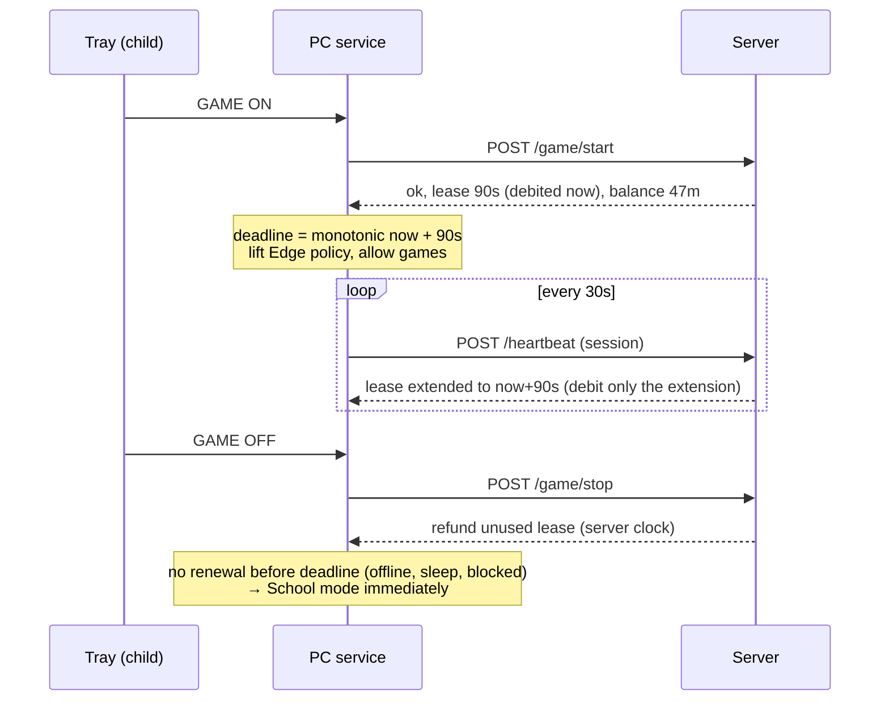

# Monitor — Redesign Plan

Status: **draft for review** · Owner: crisev

## 1. Why redesign

All the important decisions are currently made **on the child's PC**: what day it is, how much game time exists, how much was used, the carry-over, and the bonus. The PC keeps that state in places the child can change. Guardrails such as NTP sync, time-registry lockdown and watermarks raise the effort, but they can't fix this.

Holes found in the current code (child account = standard user):

| # | Hole | Where | Effect |
|---|------|-------|--------|
| 1 | Day boundary and rollover are computed from the local clock. A "new day" means a fresh quota plus carry-over. | `EnsureCurrentDayStats()` | Changing the date gives free game time |
| 2 | Daily stats (`AvailableGamingSeconds`, `TotalGamingSeconds`) are stored as JSON in `HKCU\Software\MonitorApp`, which the child can write. `cmd`/`powershell` are whitelisted, so `reg add …` works. | `SaveDailyStatsToRegistry()`, `BaseWindowsProcesses` | Can set any balance |
| 3 | Edge policy keys under HKLM get **FullControl for Users** (so the user-space app can toggle modes). | `EdgePolicyManager.EnsurePolicyPermissions()` | Can delete the URL allowlist in School mode |
| 4 | Discord webhook URLs are cached in HKCU. With a webhook URL anyone can post messages, and edit or delete the ones it posted. | `SaveWebhooksToRegistry()` | Can erase screenshots and reports |
| 5 | The app runs as the user, so it can't update itself from a protected folder. If it lives in a writable folder, it can be deleted. | `UpdateApplicationAsync()` | Updating and tamper protection conflict |

**Core principle of the redesign:** the PC never decides how much time exists. A remote server owns the clock, the ledger and the settings. The PC asks for time and enforces what it gets back. The only time measurement the PC makes is a short countdown on a monotonic timer.

## 2. Target architecture

```
                 ┌──────────────────── Cloudflare (free tier) ─────────────────────┐
 Parent phone ─▶ │  Worker "monitor"                                               │
 (PWA, browser)  │   ├─ /app/*            parent web app (static assets)           │
                 │   ├─ /api/parent/*     settings, grants, stats   (parent auth)  │
                 │   ├─ /api/device/*     heartbeat, game, upload   (device token) │
                 │   └─ cron              day rollover, offline alerts             │
                 │  D1 (SQLite)   settings · ledger · sessions · activity · events │
                 │  Secrets       Discord webhooks, signing keys                   │
                 └──────────────────────────────┬──────────────────────────────────┘
                                                │ HTTPS
                 ┌──────────── child's PC ──────┴───────────────────────────────────┐
                 │  Monitor.Service  (Windows service, LocalSystem, Program Files)  │
                 │   API client · mode/lease controller · process enforcement ·    │
                 │   Edge HKLM policies · shutdown · updater · launches the agent  │
                 │        ▲ named pipe                                              │
                 │  Monitor.Agent    (runs as child, per session)                   │
                 │   tray icon + dialog (GAME ON/OFF) · foreground/audio sampling · │
                 │   screenshots · toast notifications                              │
                 └──────────────────────────────────────────────────────────────────┘
 Discord ◀── Worker forwards screenshots and event notifications (webhook stays server-side)
```

### Why Cloudflare

Your requirements: remote, no machine to run, free, and not C# (JS preferred).

- **Workers**: serverless JavaScript/TypeScript, with HTTPS on a free `*.workers.dev` domain. The free tier is 100k requests/day; this project needs about 3–5k.
- **D1**: managed SQLite. The free tier is 5 GB, 5M rows read/day and 100k rows written/day, which is plenty for one PC.
- **Static assets**: the parent web app is served by the same Worker, so there is one deploy.
- **Cron Triggers**: day rollover and an "is the PC silent?" alert.
- **Secrets**: Discord webhook URLs live as Worker secrets, so they're never in git, the Gist or on the PC.

Alternatives considered:
- **Firebase**: Cloud Functions need the pay-as-you-go plan, and the security rules are easy to get wrong for a ledger.
- **Supabase**: Postgres, good, but free projects pause when idle and it has more moving parts.
- **Java/Spring**: would need a paid host or a machine you look after.

### Phone app

A **PWA** (the web app "installed" on the home screen) is enough. There's no app store and no Android/iOS build. Phone push notifications keep coming from **Discord**, which you already have on the phone.

## 3. Time model (highest priority)

### 3.1 Server-side ledger

Every change to the game-time balance is an **append-only ledger row**: `{date, kind, seconds, by, note, created_at}`. The balance is the sum of those rows. Each minute can be explained ("why did he have 2h today?").

| kind | when | sign |
|------|------|------|
| `daily_allowance` | start of day (server time, Europe/Bucharest), per-weekday amount | + |
| `carryover_cap` | start of day, trims the balance down to `maxBalance` | − |
| `bonus` | you grant "+N game today" | + |
| `bonus_expire` | end of day, any unspent bonus (bonus is today-only by default) | − |
| `usage` | game-session lease purchased (see 3.2) | − |
| `refund` | session stopped early, unused part of the lease | + |
| `adjustment` | manual correction from the web app | ± |

**Rollover:** `new balance = min(maxBalance, unspent regular time) + today's allowance`. You set `maxBalance` in the web app (today it's hard-coded as 5 × daily). Usage drains today's bonus first, so unspent *regular* time carries over and unspent *bonus* time doesn't.

The rollover runs lazily on the first request of a new server day, and also from an hourly cron. It is idempotent, so running it twice changes nothing.

### 3.2 Game sessions = prepaid leases



- The server debits time **before** it is used. If heartbeats stop for any reason (no internet, sleep, firewall rule, crash), the session ends at `paidUntil`, and that time is already paid. The child can never get more than the balance.
- The PC counts the lease down with `Environment.TickCount64` (monotonic, unaffected by clock or time-zone changes). Changing the PC clock does nothing.
- You can press **End gaming now** in the web app. The next heartbeat (≤ 30s) returns `mode: school`.

### 3.3 Screen time and allowed hours

- The heartbeat carries `screenActive` (session not locked). The server adds `min(serverNow − lastHeartbeat, 90s)` to today's screen time.
- The server returns `screenRemaining` and `windowRemaining` (time until today's allowed hours end). The PC counts both down on the monotonic timer, shows the 10/5/1-minute warnings and shuts down at 0, as it does now.
- **Extra school time** (your answer: "both, but only push shutdown if needed"): `+N school minutes` adds N to today's screen-time limit. If the new remaining screen time doesn't fit before the end of today's allowed hours, the server moves today's end later **just enough** to fit, but never past the `latestShutdown` setting (e.g. 21:30).

### 3.4 Offline behaviour (your answer: School only)

- **Gaming:** can't start offline. A running session ends when its lease expires (≤ 90s).
- **School mode:** keeps working with the whitelist. The PC keeps counting down screen time and allowed hours from the last values the server sent.
- **Boot without network:** an **offline budget** (e.g. 60 min) applies. It is counted only between successful server contacts, so rebooting doesn't reset it and the clock isn't involved. When it runs out: shutdown.
- The service stores the offline counter and the last server state in an ACL-protected location (SYSTEM-only). On reconnect it uploads the offline screen seconds; the server only ever adds them.
- **Cron alert:** no heartbeat for 15 min during allowed hours → Discord message ("PC silent: off, offline, or tampered?"). You decide.

## 4. Parent control (replaces the Gist)

Web app, phone-first:

- **Today**: current mode, game time left, screen time left, allowed-hours end, PC online/offline, live within 30s.
- **Quick actions**: `+15 / +30 / +60 game today`, `+30 / +60 school today`, `End gaming now`, each with an optional note. Every action is a ledger row.
- **Settings**:
  - per-weekday game allowance, screen-time limit and allowed hours
  - `maxBalance`, `latestShutdown`, offline budget
  - whitelisted apps, whitelisted sites, blocked titles (e.g. Google Doodle games on `google.com`)
- **History**: ledger/audit log.
- **Devices**: enroll a PC (shows a one-time enrollment code), see versions, set the target update version.

**Auth.** Two options:
- **Parent:** Cloudflare Access (email one-time code to your Gmail), or a small built-in login (password + passkey later). Cloudflare Access is less code, but the Zero Trust signup may ask for a card even though the plan is $0. We'll decide at setup.
- **PC:** gets its own **device token**, created at enrollment and stored hashed on the server. It can only *consume* time, report data and read its config; granting time needs parent auth. Even if the child extracted the token, it would gain him nothing.

**The Gist goes away.** The Discord webhooks become Worker secrets, and everything else moves into settings in D1.

## 5. Statistics (replaces the long Discord summaries)

- The agent samples the foreground app/title and the audio apps every 5s, as now. The service batches them into **1-minute buckets** `{minute, mode, app, site/title, fgSeconds, audioSeconds}` and uploads them with the heartbeat.
- The server stamps buckets with **server time**; the PC only sends offsets relative to the batch.
- **Dashboard**:
  - a day **timeline** (mode bands School/Gaming + the top app per 5 min)
  - per-app and per-site totals
  - game vs school per day for the last 30 days
  - killed-process attempts, tamper events
  - ledger grants
- **Discord** keeps:
  - screenshots (posted by the Worker, not the PC)
  - short events: started, gaming on/off, quota reached, extra time granted, PC silent, tamper
- Optional later: keep thumbnails in R2 (free 10 GB) to show screenshots inside the timeline.

## 6. PC client: service + agent split, updates, tamper resistance

| Concern | Monitor.Service (SYSTEM) | Monitor.Agent (child) |
|---|---|---|
| Server communication, device token | ✅ (token in ACL-protected ProgramData) | ❌ |
| Mode/lease controller, countdowns, shutdown | ✅ | ❌ |
| Kill non-whitelisted processes | ✅ (SYSTEM can kill any user process) | ❌ |
| Edge policies in HKLM | ✅ (keys back to default ACL: Users read-only) | ❌ |
| Tray icon, dialog, GAME ON/OFF button, toasts | ❌ | ✅ → request over named pipe |
| Foreground window, audio, screenshots | ❌ | ✅ (must run in the user's desktop) |
| Start agent in each logged-on session, restart if killed | ✅ (`WTSQueryUserToken` + `CreateProcessAsUser`) | — |

- **Agent killed:** the service relaunches it, logs a tamper event and forces School mode while the agent is missing.
- **Install:** `C:\Program Files\Monitor\` with a one-time admin install script (`install.ps1`: copy files, `New-Service`, recovery = restart, ACLs). Later we can add an MSI.
- **Auto-update:**
  - The service asks `/api/device/update` and gets `{version, url, sha256}`. You set the target version in the web app, or CI registers each release.
  - It downloads the new version into `versions\x.y.z\` and verifies the SHA-256.
  - It starts a copied `Monitor.Updater.exe` as SYSTEM. The updater stops the service, points `current` at the new folder, starts the service and waits for a successful heartbeat. If there's none within 2 min, it **rolls back** to the previous folder.
  - Everything runs as SYSTEM, so there are no permission problems, and the child can't delete anything.
- `cmd`/`powershell`/`wt` come off the built-in allow list. If he needs a console for programming, add it to the allowed apps in settings; Code::Blocks/VS Code child processes are still allowed through process-tree tracking.
- **Admin bypass** stays: when an admin user is logged on, nothing is enforced or reported.

## 7. What gets removed

| Item | Replaced by | Phase |
|---|---|---|
| `clear_discord_channel.py` | — | 1 |
| Gist config (`BlockListGistUrl`, `GIST_EXAMPLE.json`) | D1 settings + web app | 1 |
| Google Sheets webhook | D1 statistics | 1 |
| Local rollover, local bonus, stats in HKCU | server ledger | 1 |
| NTP/HTTP time sync, time watermark, Windows time registry lockdown | server clock + monotonic lease | 1 |
| Discord webhooks on the PC (HKCU cache) | Worker proxies Discord | 1 |
| `mode: blacklist` + `blockedProcessNames` | whitelist only (`blockedTitles` kept as an exception list) | 1 |
| Long Discord text summaries (`SendDailyReportAsync`) | dashboard | 3 |
| In-process self-updater, `ProtectProcess` DACL trick, Users FullControl on Edge keys | service + updater | 2 |
| Unused interval `type` ("Gaming"/"School" on intervals is effectively unused) | per-weekday allowed hours | 1 |

## 8. Repository layout

```
/client/                 C# (.NET 10)
  Monitor.sln
  Monitor.Core/          API client, lease controller, enforcement, Edge policies (shared logic)
  Monitor.Agent/         tray + sampling + screenshots     (phase 1: the only exe)
  Monitor.Service/       Windows service                    (phase 2)
  Monitor.Updater/       swap + rollback                    (phase 2)
  install/install.ps1
/server/                 Cloudflare Worker (TypeScript, Hono router, zod validation)
  src/  migrations/  wrangler.toml
/web/                    Parent app (Vite + React + TypeScript, Chart.js), built into /server assets
/docs/
.github/workflows/       client release (exists) + server deploy (new)
```

Phase 1 also breaks the 3,300-line `Program.cs` into classes (`ApiClient`, `ModeController`, `ProcessEnforcer`, `EdgePolicyManager`, `ActivitySampler`, `ScreenshotService`, `TrayService`). That makes the phase-2 split a move between projects, not a rewrite.

## 9. Phases

Phase 1 is the priority. Phases 2 and 3 are independent and can be swapped. Phase 2 is listed first because holes #2–#4 still allow free browsing or erasing evidence in School mode.

### Phase 0 — Environment setup (≈ ½ day, mostly you, guided)
1. Create a free Cloudflare account. Install Node.js LTS and `npm i -g wrangler`, then `wrangler login`.
2. `wrangler d1 create monitor` → put the id in `server/wrangler.toml`.
3. `wrangler secret put DISCORD_TEXT_WEBHOOK` / `DISCORD_IMAGE_WEBHOOK`.
4. Create a Cloudflare API token (Workers + D1 edit) and add it as GitHub repo secret `CLOUDFLARE_API_TOKEN` so CI deploys the server.
5. For the C# side: install the .NET 10 SDK and VS Code with C# Dev Kit, or Visual Studio Community, on a Windows machine.

### Phase 1 — Server-authoritative time (fixes the main problem)
- **Server:**
  - D1 schema (settings, ledger, sessions, devices, events)
  - day rollover, game-lease endpoints, heartbeat, config endpoint
  - device enrollment
  - Discord proxy (screenshots + events)
- **Minimal parent page:** Today view + quick actions + settings form. Enough to retire the Gist.
- **Client (still one user-space exe):**
  - replace Gist/local accounting with the API
  - monotonic lease enforcement
  - offline rules from §3.4
  - remove the items marked phase 1 in §7
  - keep the tray, dialog, whitelist, Edge policies and screenshots
- **Acceptance tests (must all hold):**
  - change the date/time/time zone
  - edit any HKCU value
  - disconnect the network mid-game
  - sleep/hibernate mid-game
  - reboot repeatedly
  - kill the app
  - none of these can make game time used exceed the server balance; ledger and Discord show what happened

### Phase 2 — Service + agent, install to Program Files, auto-update
- Split the client as in §6, plus the install script, updater with rollback, and CI release with SHA-256.
- Lock down: default ACLs on Edge keys, protected state, no console tools by default.

### Phase 3 — Parent web app and statistics
- Activity buckets upload, dashboard (timeline, per-app/site, trends), PWA install, ledger/audit view.
- Replace the long Discord summaries.
- Optional: an **"Ask for more time"** button in the tray. It sends a Discord ping, and you approve in one tap in the web app.

## 10. Open decisions (defaults used unless you say otherwise)

1. **Bonus game time is today-only**: unspent bonus expires at midnight; unspent regular time carries over. → OK?
2. **Carry-over cap** `maxBalance`: starting value? (Current code: 5 × daily = 5 h for 60 min/day.)
3. **Gaming hours**: can game mode start any time inside allowed hours, or only after a set time (e.g. after 14:00)?
4. **Per-weekday settings** (different weekend allowance/hours): wanted from day one?
5. **Screen time counts both modes** (School + Gaming), as today. → OK?
6. **One child, one PC** to start? The model will support more devices, but the UI will assume one.
7. **Console tools** (`cmd`, PowerShell, Terminal): does he need them for programming in School mode?
8. **Parent login**: Cloudflare Access (less code) or built-in login?
