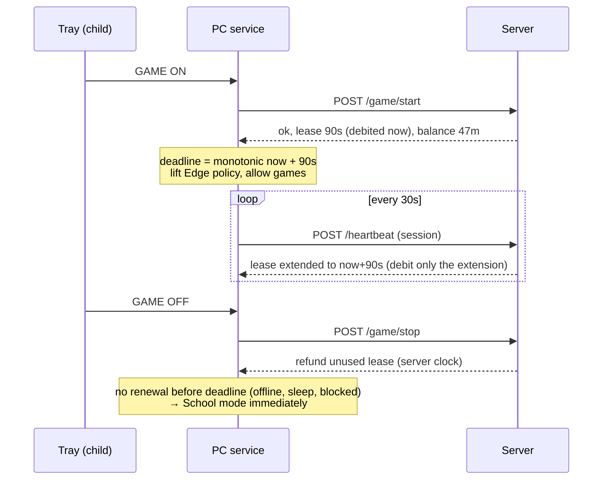

# Monitor v2 — Redesign Plan

Status: **Phase 1 (server + parent web app) implemented in `v2/server`; Phase 2 (Windows client) implemented in `v2/client`, acceptance tests on the PC pending** · Owner: crisev

v2 is built **from scratch in a new folder `v2/`**. The current app (repo root) is not modified. It keeps running on the PC until v2 passes its acceptance tests, and is then uninstalled.

## 1. Why redesign

All the important decisions are currently made **on the child's PC**: what day it is, how much game time exists, how much was used, the carry-over, and the bonus. The PC keeps that state in places the child can change. Guardrails such as NTP sync, time-registry lockdown and watermarks raise the effort, but they can't fix this.

Holes found in the current code (child account = standard user):

| # | Hole | Where | Effect |
|---|------|-------|--------|
| 1 | Day boundary and rollover are computed from the local clock. A "new day" means a fresh quota plus carry-over. | `EnsureCurrentDayStats()` | Changing the date gives free game time |
| 2 | Daily stats (`AvailableGamingSeconds`, `TotalGamingSeconds`) are stored as JSON in `HKCU\Software\MonitorApp`, which the child can write (e.g. `reg add` from cmd/PowerShell). | `SaveDailyStatsToRegistry()` | Can set any balance |
| 3 | Edge policy keys under HKLM get **FullControl for Users** (so the user-space app can toggle modes). | `EdgePolicyManager.EnsurePolicyPermissions()` | Can delete the URL allowlist in School mode |
| 4 | Discord webhook URLs are cached in HKCU. With a webhook URL anyone can post messages, and edit or delete the ones it posted. | `SaveWebhooksToRegistry()` | Can erase screenshots and reports |
| 5 | The app runs as the user, so it can't update itself from a protected folder. If it lives in a writable folder, it can be deleted. | `UpdateApplicationAsync()` | Updating and tamper protection conflict |

**Core principle of v2:** the PC never decides how much time exists. A remote server owns the clock, the ledger and the settings. The PC asks for time and enforces what it gets back. The only time measurement the PC makes is a short countdown on a monotonic timer. All enforcement on the PC runs as **SYSTEM**, where a standard user can't reach it.

## 2. Target architecture

```
                 ┌──────────────────── Cloudflare (free tier) ─────────────────────┐
 Parent phones ─▶│  Cloudflare Access (Google login, 2 allowed emails)             │
 (PWA, browser)  │  Worker "monitor"                                               │
                 │   ├─ /app/*            parent web app (static assets)           │
                 │   ├─ /api/parent/*     settings, grants, stats   (Access JWT)   │
                 │   ├─ /api/device/*     heartbeat, game, upload   (device token) │
                 │   └─ cron              day rollover, "PC silent" alerts         │
                 │  D1 (SQLite)   settings · ledger · sessions · activity · events │
                 │  Secrets       Discord webhooks                                 │
                 └──────────────────────────────┬──────────────────────────────────┘
                                                │ HTTPS
                 ┌──────────── child's PC ──────┴───────────────────────────────────┐
                 │  Monitor.Service  (Windows service, LocalSystem, Program Files)  │
                 │   API client · mode/lease controller · process enforcement ·    │
                 │   Edge HKLM policies · shutdown · updater · launches the agent  │
                 │        ▲ named pipe                                              │
                 │  Monitor.Agent    (runs as child, per session)                   │
                 │   tray icon + dialog (GAME ON/OFF) · foreground/audio sampling · │
                 │   screenshots · toast notifications                              │
                 └────────────────────────────────────────────────────────────────┘
 Discord ◀── Worker forwards screenshots and event notifications (webhook stays server-side)
```

### Why Cloudflare

Your requirements: remote, no machine to run, free, and JavaScript rather than C#.

- **Workers**: serverless TypeScript with HTTPS on a free `*.workers.dev` domain. The free tier is 100k requests/day; this project needs about 3–5k.
- **D1**: managed SQLite. The free tier is 5 GB, 5M rows read/day and 100k rows written/day.
- **Static assets**: the parent web app is served by the same Worker, so there is one deploy.
- **Cron Triggers**: day rollover and the "PC silent" alert.
- **Cloudflare Access** (Zero Trust, free up to 50 users): puts a login screen in front of the web app. You and his mother log in with your Google accounts. Only the emails you list get in.
- **Secrets**: Discord webhook URLs are Worker secrets, so they're never in git or on the PC.

### Phone app

A **PWA** (the web app "installed" on the home screen) is enough. There's no app store and no Android/iOS build. Phone push notifications keep coming from **Discord**.

## 3. Time model

### 3.1 Game time: server-side ledger

Every change to the game balance is an **append-only ledger row**: `{date, kind, seconds, by, note, created_at}`. The balance is the sum of those rows. Each minute can be explained, including **who** granted it: the parent's email, taken from the Cloudflare Access login.

| kind | when | sign |
|------|------|------|
| `daily_allowance` | start of day (server time, Europe/Bucharest) | + |
| `grant` | a parent grants "+N game" in the web app | + |
| `usage` | game-session lease purchased (see 3.2) | − |
| `refund` | session stopped early, unused part of the lease | + |
| `cap` | start of day, trims the balance down to `maxGameBalance` | − |
| `adjustment` | manual correction (± any amount) | ± |

- **All game time carries over** (daily allowance and grants alike), up to `maxGameBalance`.
- Start of day: `balance = min(maxGameBalance, balance + dailyGameAllowance)`, matching the old app's "5 days" rule. A grant always counts in full on the day it's given; the cap is applied the next morning.
- `dailyGameAllowance` can be **0** (the usual case). Game time then exists only through grants.
- `maxGameBalance` is set in **minutes**, not as "N × daily", because N × 0 = 0 would erase every grant at midnight. Default **300 min** (5 days × 60 min).
- The rollover runs lazily on the first request of a new server day, and also from an hourly cron. It is idempotent, so running it twice changes nothing.

### 3.2 Game sessions = prepaid leases



- The server debits time **before** it is used. If heartbeats stop for any reason (no internet, sleep, firewall rule, crash), the session ends at `paidUntil`, and that time is already paid. The child can never get more than the balance.
- The PC counts the lease down with `Environment.TickCount64` (monotonic, unaffected by clock or time-zone changes). Changing the PC clock does nothing.
- **Gaming can start any time.** The only limit is the balance. There are no time-of-day rules.
- **End gaming now** in the web app → the next heartbeat (≤ 30s) returns `mode: school`.

### 3.3 Screen time (no time-of-day limits)

- There are **no allowed-hours windows and no night limit** for now. The only limits are usage limits: the game balance and the daily screen-time limit.
- The heartbeat carries `screenSeconds`: seconds the screen was in use since the last acknowledged heartbeat, measured on the PC's monotonic clock and including offline time. The server adds `min(screenSeconds, server time elapsed since the previous heartbeat + 5s)`, so the PC can never report more time than really passed. Both School and Gaming time count.
- The server returns `screenRemaining`. The PC counts it down on the monotonic timer, shows the 10/5/1-minute warnings and shuts down at 0, as it does now.
- **Extra school time** (`+N school today`) raises **today's** screen-time limit only. It does **not** carry over, and it resets at midnight.
- The data model keeps an optional `allowedHours` field (off by default), so a night limit can be switched on later from the web app without code changes.

### 3.4 Offline behaviour: School only

- **Gaming:** can't start offline. A running session ends when its lease expires (≤ 90s).
- **School mode:** keeps working with the whitelist. The PC counts down screen time from the last value the server sent.
- **Boot without network:** an **offline budget** (default 60 min) applies. It is counted only between successful server contacts, so rebooting doesn't reset it and the clock isn't involved. When it runs out: shutdown.
- The service stores the offline counter and the last server state in an ACL-protected location (SYSTEM-only). On reconnect the offline screen seconds go up with the next heartbeat (`screenSeconds`).
- **Cron alert:** no heartbeat for 15 min while the PC was last seen with an active screen → Discord message ("PC silent: off, offline, or tampered?").

## 4. Where things are configured (the Gist goes away)

Almost everything is edited in the **web app → Settings**. The PC picks up changes within 30 seconds.

| Setting | Where | Default |
|---|---|---|
| Daily game allowance (min) | Web app → Settings | 0 |
| Max game balance / carry-over cap (min) | Web app → Settings | 300 |
| Daily screen-time limit (min) | Web app → Settings | 180 |
| Offline budget (min) | Web app → Settings | 60 |
| Screenshot interval (min) | Web app → Settings | 5 |
| Allowed apps (School mode) | Web app → Settings | from the current Gist list + console tools |
| Allowed sites (School mode) | Web app → Settings | from the current Gist list |
| Blocked titles (exceptions inside allowed sites, e.g. Google Doodle games) | Web app → Settings | from the current Gist list |
| Allowed hours (optional night limit) | Web app → Settings | off |
| +game / +school today / End gaming now / correction | Web app → Today | — |
| PC enrollment, target client version | Web app → Devices | — |
| **Who can log in** (you + his mother) | Cloudflare dashboard → Zero Trust → Access policy | 2 emails |
| **Discord webhook URLs** | Cloudflare dashboard → Worker → Settings → Secrets | — |

The last two rows are rarely changed and are deliberately kept out of the web app. Access control can't be managed from inside the thing it protects, and secrets should never be readable in a web page.

**Login:**
- Cloudflare Access with **Google** as the login method; one-time email codes are the zero-setup fallback.
- The Access policy allows exactly your email and his mother's.
- She doesn't need a Cloudflare account; she just logs in with Google.
- The Worker also checks the Access JWT, and records the email on every grant.

**PC:** gets its own **device token**, created at enrollment and stored hashed on the server. It can only *consume* time, report data and read its config; granting time needs a parent login. Even if the child extracted the token, it would gain him nothing.

## 5. Statistics (replaces the long Discord summaries) — server side and Activity page ✅ done

- The agent samples the foreground app/title and the audio apps every 5s. The service batches them into **1-minute buckets** `{minute, mode, app, site/title, fgSeconds, audioSeconds}` and uploads them with the heartbeat. The server stamps them with **server time**.
- **Dashboard**:
  - a day **timeline** (School/Gaming bands + the top app per 5 min)
  - per-app and per-site totals
  - game vs school per day for the last 30 days
  - killed-process attempts, tamper events
  - the ledger
- **Discord** keeps:
  - screenshots (posted by the Worker, not the PC)
  - short events: started, gaming on/off, balance empty, time granted (and by whom), PC silent, tamper
- Optional later: keep thumbnails in R2 (free 10 GB) to show screenshots inside the timeline.

## 6. Windows client v2: service + agent

v2 is new code, so it starts with the split. Building a user-space app first and splitting it later would mean writing it twice. Proven pieces of the current app are **copied** (not moved) and cleaned up:
- Edge policy handling
- whitelist and process-tree logic (IDE child processes, toolchain)
- the base Windows process list
- tray dialog, screenshot capture, audio detection

| Concern | Monitor.Service (SYSTEM) | Monitor.Agent (child) |
|---|---|---|
| Server communication, device token | ✅ (token in ACL-protected ProgramData) | ❌ |
| Mode/lease controller, countdowns, shutdown | ✅ | ❌ |
| Kill non-whitelisted processes | ✅ (SYSTEM can kill any user process) | ❌ |
| Edge policies in HKLM | ✅ (default ACL: Users read-only) | ❌ |
| Tray icon, dialog, GAME ON/OFF button, toasts | ❌ | ✅ → request over named pipe |
| Foreground window, audio, screenshots | ❌ | ✅ (must run in the user's desktop) |
| Start agent in each logged-on session, restart if killed | ✅ (`WTSQueryUserToken` + `CreateProcessAsUser`) | — |

- **Agent killed:** the service relaunches it, logs a tamper event and forces School mode while the agent is missing.
- **Console tools** (`cmd`, PowerShell, Terminal) **stay allowed**, since he needs them for programming. That's acceptable in v2: everything that matters runs as SYSTEM or on the server, so the console can't change balances, policies or the service.
- **Admin bypass** stays: when an admin user is logged on, nothing is enforced or reported.
- **Install:** `C:\Program Files\MonitorV2\` with a one-time admin script `install.ps1`: copy files, register the service with restart-on-failure, set ACLs, enroll with a one-time code from the web app.
- **Auto-update:**
  - The service asks `/api/device/update` and gets `{version, url, sha256}`. You set the target version in the web app, or CI registers each release.
  - It downloads the new version into `versions\x.y.z\` and verifies the SHA-256.
  - It starts a copied `Monitor.Updater.exe` as SYSTEM. The updater stops the service, switches to the new folder, starts the service and waits for a successful heartbeat. If there's none within 2 min, it **rolls back**.
  - Everything runs as SYSTEM, so there are no permission problems, and the child can't delete anything.

**Testing without conflicts:** the old and new apps both kill processes and set Edge policies, so they can't run side by side. Test v2 on another Windows PC, a VM, or a test account on his PC with the old app not running there. Then do the switch: uninstall old, install v2.

## 7. Not carried into v2

| Item | Replaced by |
|---|---|
| Gist config | D1 settings + web app |
| Google Sheets webhook | D1 statistics |
| Local rollover/bonus, stats in HKCU | server ledger |
| NTP/HTTP time sync, watermark, Windows time registry lockdown | server clock + monotonic lease |
| Discord webhooks on the PC | Worker proxies Discord |
| `mode: blacklist`, `blockedProcessNames` | whitelist only (`blockedTitles` kept as exceptions) |
| School/Gaming time intervals | usage limits only (optional `allowedHours`, off) |
| Long Discord text summaries | dashboard |
| In-process self-updater, `ProtectProcess` DACL trick, Users FullControl on Edge keys | service + updater |
| `clear_discord_channel.py` | — (can be deleted from the repo whenever you like) |

## 8. Repository layout

```
/ (existing app, untouched)
/v2/
  server/              Cloudflare Worker (TypeScript, Hono router, zod validation)
    src/  migrations/  test/  wrangler.jsonc
    public/            Parent web app: plain HTML/CSS/JS, no build step (charts added in Phase 4)
  client/              C# (.NET 10)
    MonitorV2.sln
    Monitor.Core/      API client, lease controller, enforcement, Edge policies
    Monitor.Service/   Windows service (LocalSystem)
    Monitor.Agent/     tray + sampling + screenshots (user session)
    Monitor.Updater/   swap + rollback
    install/install.ps1
  tools/fake-device.mjs  simulates a PC against the server (for testing without Windows)
  docs/SETUP.md          step-by-step Cloudflare setup (Phase 0)
.github/workflows/     existing release (unchanged) + v2-server.yml (test + deploy) + v2-client.yml (test + publish the install folder)
```

## 9. Phases

### Phase 0 — Environment setup (≈ ½ day, you): follow [`v2/docs/SETUP.md`](../v2/docs/SETUP.md)
1. **Cloudflare:**
   - account (you already sign in with Google)
   - Node.js LTS + `npm i -g wrangler`, then `wrangler login`
2. **D1:** `wrangler d1 create monitor` → put the id in `v2/server/wrangler.toml`.
3. **Secrets:** `wrangler secret put DISCORD_TEXT_WEBHOOK` / `DISCORD_IMAGE_WEBHOOK`.
4. **Zero Trust (free plan):**
   - add the Google login method (needs a Google OAuth client from Google Cloud Console, free; or start with one-time email codes)
   - create an Access application for the Worker's `/app` and `/api/parent` paths
   - policy: allow your email + his mother's
   - note: the Zero Trust signup may ask for a card even on the $0 plan
5. **CI deploy:** Cloudflare API token (Workers + D1 edit) → GitHub repo secret `CLOUDFLARE_API_TOKEN`.
6. **For the C# client:** .NET 10 SDK and Visual Studio Community or VS Code + C# Dev Kit, on Windows.

### Phase 1 — Server + parent web app (minimal) ✅ done
- **Server:**
  - D1 schema (settings, ledger, sessions, devices, events)
  - day rollover, game leases, heartbeat, config, device enrollment
  - Discord proxy
  - unit tests for the ledger and lease math
- **Web app:** Today view (balances, quick actions, live mode), Settings form, ledger history, Devices.
- **Testable before any C#:** `tools/fake-device.mjs` plays the PC (start game, heartbeat, go silent, stop).

### Phase 2 — Windows client v2 (service + agent) and install — implemented, see [`v2/client/README.md`](../v2/client/README.md)
- Core, Service, Agent, install script. Copy and clean up the reusable parts of the old app.
- **Acceptance tests (must all hold):**
  - change the date/time/time zone
  - edit any HKCU value
  - disconnect the network mid-game
  - sleep/hibernate mid-game
  - reboot repeatedly
  - kill the agent
  - use cmd/PowerShell
  - none of these can make game time used exceed the server balance, and none removes the Edge allowlist; ledger and Discord show what happened
- **Switch over** on his PC: uninstall old, install v2.

### Phase 3 — Auto-update
- Updater with rollback, CI release with SHA-256, target version from the web app.

### Phase 4 — Statistics and polish
- Activity buckets, dashboard (timeline, per-app/site, trends), PWA install.
- Optional: an **"Ask for more time"** tray button that sends a Discord ping, approved by a parent in one tap.

## 10. Decisions log

| # | Question | Decision |
|---|---|---|
| 1 | Does unused game time carry over? | **Yes**, all game time (allowance and grants), capped. Extra school time is today-only. |
| 2 | Carry-over cap | Configurable in the web app, in minutes; default 300 (≈ 5 days × 60 min). |
| 3 | Time-of-day limits | **None** for now; usage limits only. Optional `allowedHours`, off. |
| 4 | Per-weekday settings | **No**, one set of values for all days. |
| 5 | Console tools in School mode | **Allowed.** |
| 6 | Parent login | Cloudflare Access + Google; you and his mother. |
| 7 | Client approach | New code in `v2/`; current app untouched until switch-over. |
| 8 | Screen time counts both modes | Yes (default, not changed). |
| 9 | One child, one PC | Yes for the UI; the data model allows more. |
| 10 | What is blocked in Gaming mode | **Nothing.** |
| 11 | When today's screen time is used up | Warnings at 10, 5 and 1 minutes, then **shut down**. |
| 12 | Where the Windows client is tested | The parent's PC, logged in as a separate **standard** (non-admin) test account, since admin accounts are not monitored. |
